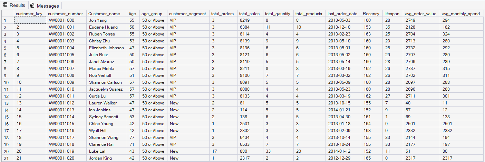

# SQL Customer Analysis

## Project Overview

This project focuses on analyzing customer and sales data using Microsoft SQL Server. The project uses SQL queries to explore business performance, customer behavior, trends, and customer segmentation.

## Tools Used

- Microsoft SQL Server
- SQL Server Management Studio (SSMS)
- SQL

## Analysis Performed

### 1. Trends Analysis
Analyzed sales, customers, and quantity over time by year and month.

### 2. Cumulative Analysis
Calculated monthly and yearly sales along with running totals and average-price analysis.

### 3. Performance Analysis
Compared yearly product sales against average performance and previous-year sales.

### 4. Proportional Analysis
Calculated category-level sales contribution and percentage of total sales.

### 5. Customer Segmentation
Segmented customers into VIP, Regular, and New groups based on customer lifespan and spending.

### 6. Customer Report
Created a customer-level report containing customer information, sales metrics, purchasing behavior, recency, lifespan, average order value, and average monthly spending.

## SQL Concepts Used

- SELECT, WHERE, and ORDER BY
- Aggregate Functions
- GROUP BY
- LEFT JOIN
- CASE Statements
- Common Table Expressions (CTEs)
- Subqueries
- Window Functions
- Running Totals
- Year-over-Year Analysis
- Date and Time Functions
- Percentage-of-Total Analysis
- Customer Segmentation
- Customer-Level KPI Calculations

## Project Files

| File | Description |
|---|---|
| `Comulative_Analysis.sql` | Cumulative analysis of business data |
| `Performance Analysis.sql` | Performance-related analysis |
| `Propositional Analysis.sql` | Proportional analysis |
| `Trends (Change over Time).sql` | Analysis of changes and trends over time |
| `Segmentation.sql` | Customer segmentation analysis |
| `Customer Report.sql` | Detailed customer reporting |
| `Main Project.sql` | Complete project SQL script |

## Project Objective

The objective of this project is to use SQL Server to transform raw business data into meaningful insights through structured queries and analytical techniques.

## Customer Report Preview

